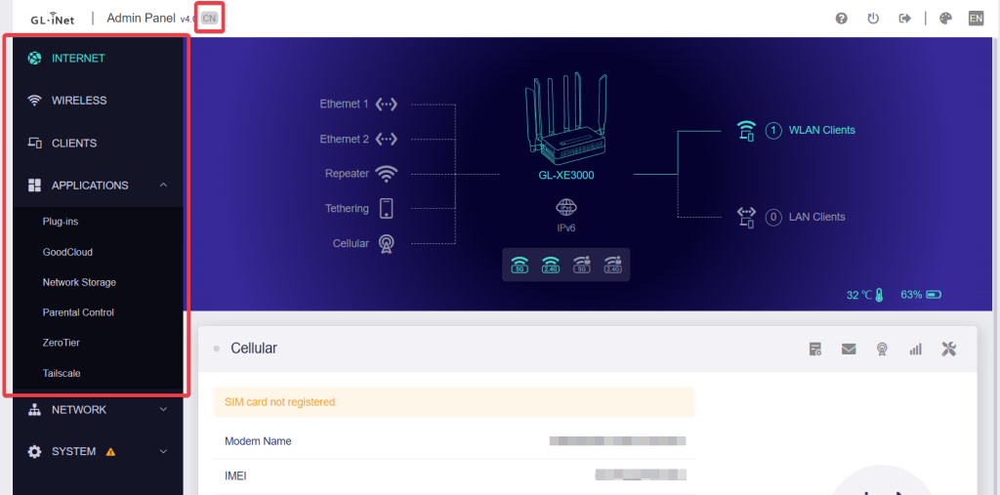
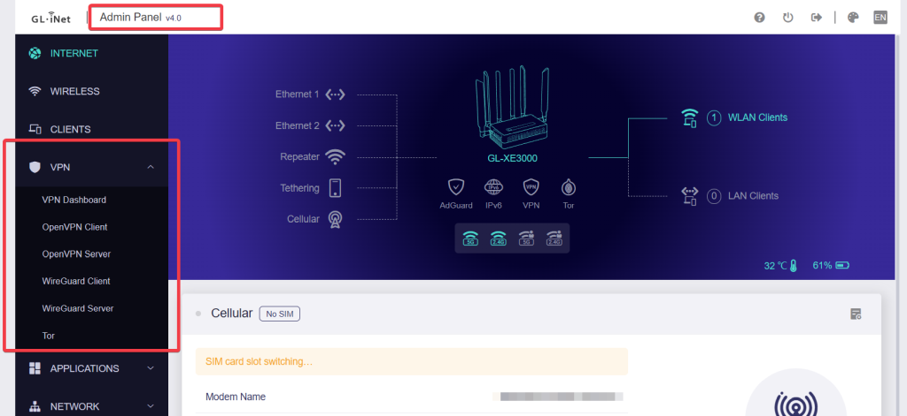

# GL.iNet Remove China Lock


This script is designed to unlock a GL.iNet router that has been locked due to laws in China.

By running this script, the VPN features and AdGuard Home will be available in the GL GUI.

## Warnings & Disclaimers

**WARNING**: This script is **highly experimental** and not officially supported by GL.iNet. 

It could potentially **harm your router** and **void your warranty**. **Unbricking might not be possible!**

Make sure to copy the backup file to a safe place! **Do it before you run `firstboot` because this will delete EVERYTHING.**

After running this script, you will need to set up the device again. **A full reset is required!**

On devices with 5G/LTE modems changing the country code might affect the modem's functionality as well.

## Usage

```shell
./glinet-remove-chinalock.sh [--new-country-code=<COUNTRY_CODE>] [--country-code=<COUNTRY_CODE>] [--help]
```

### Options

- `--new-country-code`: Set the new country code (default: US) - Must be ISO 3166-1 alpha-2 code
- `--country-code`: Set the current country code (default: CN) - Must be ISO 3166-1 alpha-2 code
- `--help`: Show the help message

## Example

```shell
./glinet-remove-chinalock.sh --new-country-code=DE
```

This will remove the China lock and set the country code to DE (Germany).

| Before                       | While running                                                                      | After                      |
| ---------------------------- | ---------------------------------------------------------------------------------- | -------------------------- |
|  | [](https://asciinema.org/a/657862) |  |

## Steps After Running the Script

1. Run the command: `firstboot` and confirm with `y`
2. Run the command: `reboot`
3. Set up the device again, all settings will be lost

## Tested Devices

| Device                        | Tested             |
| ----------------------------- | ------------------ |
| GL-MT3000 / AX3000 (Beryl AX) | :white_check_mark: |
| GL-MT6000 (Flint 2)           | :white_check_mark: |
| GL-XE3000 (Puli AX)           | :white_check_mark: |

## Issues

Please report issues to this repository, make sure to include your router model and firmware version.

## License

This project is licensed under the MIT License - see the [LICENSE](LICENSE) file for details.
